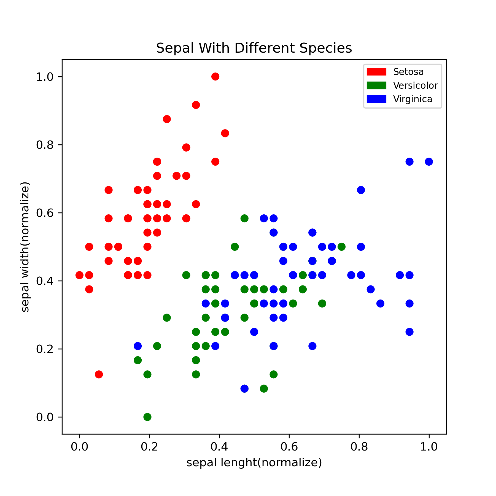
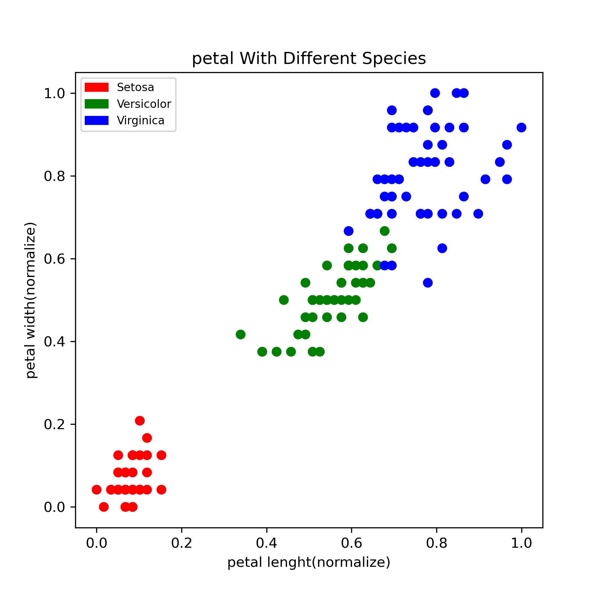

# Markdown & Python 與Jupyter NoteBook於Visual Studio Code 

## -內容如下
> OpenDate:2021-09-17 
> Content:與Python相關學習 
> Author:柴犬陪唸書  
## -目錄
 - [1.Module:Turtle](#1)
 - [2.Content:EDA](#2)

## -題目

# <h2 id="1">1.Module:Turtle</h2>
### [Turtle_Parabolic_Curve.ipynb](https://github.com/Chen-Han-Yu/Python/blob/main/Tech/Turtle_Parabolic_Curve.ipynb)

    - 利用Turtle畫拋物線

</video>

### [Turtle_Stop.ipynb](https://github.com/Chen-Han-Yu/Python/blob/main/Tech/Turtle_Stop.ipynb)
    - 利用Turtle畫暫停標誌

# <h2 id="2">2.Content:EDA</h2>
### [EDA_exercise.ipynb](https://github.com/Chen-Han-Yu/Python/blob/main/Tech/Iris/EDA_exercise.ipynb)
Data Set: [Iris](./Iris/iris.md)  
Package:
- sklearn 
  1.datasets iris 
  2.preprocessing 
- matplotlib 
  1.%matplotlib inline 
  2.pyplot 
  3.patches 
- pandas 
  1.pd.DataFrame 
  2.loc/iloc 
  3.groupby 
  4.head() 
  5.describe() 
  6.quantile() 
  7.plot() 
>不同種類的頻率圖

>不同種類的萼片長寬有一定的線性關係

>不同種類的花瓣樣本集中區域可以分三區

