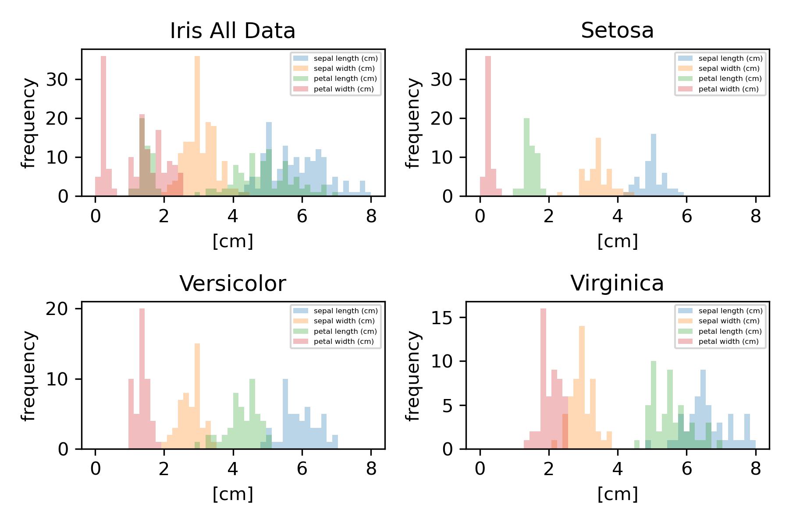

# Markdown & Python 與Jupyter NoteBook於Visual Studio Code 

## -內容如下
> OpenDate:2021-09-17 
> Content:與Python相關學習 
> Author:柴犬陪唸書  
## -目錄
 - [1.Module:Turtle](#1)
 - [2.Content:EDA](#2)

## -題目

# <h2 id="1">1.Module:Turtle</h2>
##### [Turtle_Parabolic_Curve.ipynb](https://github.com/Chen-Han-Yu/Python/blob/main/Tech/Turtle_Parabolic_Curve.ipynb)

    - 利用Turtle畫拋物線

</video>

##### [Turtle_Stop.ipynb](https://github.com/Chen-Han-Yu/Python/blob/main/Tech/Turtle_Stop.ipynb)
    - 利用Turtle畫暫停標誌

# <h2 id="2">2.Content:EDA</h2>
##### [EDA_exercise.ipynb](https://github.com/Chen-Han-Yu/Python/blob/main/Tech/Iris/EDA_exercise.ipynb)
    - sklearn
      1.datasets iris
      2.preprocessing
    - matplotlib
      1.%matplotlib inline
      2.pyplot
      3.patches
    - pandas
      1.pd.DataFrame
      2.loc/iloc
      3.groupby
      4.head()
      5.describe()
      6.quantile()
      7.plot()

>不同種類的萼片長寬有一定的線性關係

>不同種類的花瓣樣本集中區域可以分三區

